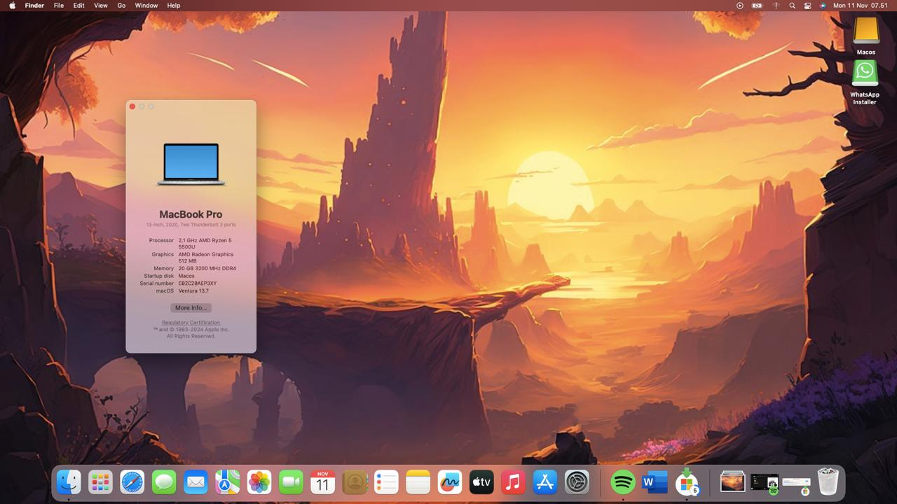

# Acer Aspire 5 A515-46 Ryzentosh Sequoia

macOS Sequoia on Acer Aspire 5 A515-45 AMD Ryzen 5 5500U with Radeon Graphics.

# Screenshots

<!--

-->

## Configuration

| Specifications      | Details                                            |
| ------------------- | -------------------------------------------------- |
| Laptop Model        | Aspire 5 a515-45                                   |
| Processor           | AMD Ryzen 5 5500U                                  |
| Graphics            | AMD Radeon Graphics                                |
| RAM                 | 16GB DDR4-2666Mhz                                  |
| Disk                | RX7 ITB NVME SSD                                   |
| Audio               | Realtek HD Audio ALC256                            |
| Wifi                | Mediatek MT7921LE                                  |
| Ethernet            | RealTek RTL8111H PCI-E Gigabit Ethernet            |

## What's working

- [x] Audio (Input & Output)
- [x] iGPU
- [x] ACPI Display brightness
- [x] Ethernet
- [x] Sleep + Wake
- [x] Touchpad + Gestures
- [x] Sleep, Restart, Shut Down
- [x] Web Camera
- [x] iServices (Messages, FaceTime, etc.)

## What's not working

- [ ] WIFI I use dongle WIFI USB
- [ ] HDMI port Audio

## Fix Google Chrome crash on AMD Radeon GPU
- [ ] You can check https://chefkissinc.github.io/applehax/nootedred/

## Credits

- Thanks to [Acidanthera](https://github.com/acidanthera) for providing [AppleALC](https://github.com/acidanthera/AppleALC), [AppleSupportPkg](https://github.com/acidanthera/AppleSupportPkg),  [Lilu](https://github.com/acidanthera/Lilu), [OcBinaryData](https://github.com/acidanthera/OcBinaryData), [OpenCorePkg](https://github.com/acidanthera/OpenCorePkg), [VirtualSMC](https://github.com/acidanthera/VirtualSMC), [VoodooInput](https://github.com/acidanthera/VoodooInput), and [VoodooPS2](https://github.com/acidanthera/VoodooPS2).
- Thanks to (https://github.com/ChefKissInc/NootedRed) for AMD Radeon Graphics driver
- Thanks to [alexandred](https://github.com/alexandred) for providing [VoodooI2C](https://github.com/alexandred/VoodooI2C).
- Thanks to [corpnewt](https://github.com/corpnewt) for providing [USBMap](https://github.com/corpnewt/USBMap) and [ProperTree](https://github.com/corpnewt/ProperTree).
- Thanks to [zxystd](https://github.com/zxystd) for providing [itlwm](https://github.com/OpenIntelWireless/itlwm) and [IntelBluetoothFirmware](https://github.com/zxystd/IntelBluetoothFirmware).
